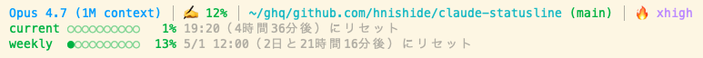

# claude-statusline

Claude Code 用の高機能なステータスラインを設定するツール。モデル情報・コンテキスト使用量・作業ディレクトリ・Gitブランチ・worktree・レートリミットを一目で把握できる。



## 表示内容

**1行目** — `モデル │ コンテキスト使用率 │ 作業ディレクトリ (ブランチ) │ effort`

- **モデル名** — `Opus 4.7 (1M context)` のように Claude Code 側の表示名をそのまま反映
- **コンテキスト使用率** — `✍️ 12%` のように残量を％で表示。50/70/90％を境に green → orange → yellow → red と段階的に色が変わる
- **作業ディレクトリ** — フルパス表示（`$HOME` は `~` に短縮）
- **Gitブランチ** — `(main)` 形式で表示。未コミット変更があると `(main*)` のようにアスタリスクが付く
- **Worktree マーカー** — linked worktree 内にいる時は `⎇ wt` が黄色で付く
- **`⚡` インジケータ** — `--dangerously-skip-permissions` で起動している時のみ表示
- **effort** — `🔥 xhigh` のように Claude Code 側の effort レベルをそのまま表示

**2行目以降** — レートリミット

- **current** — 5時間枠の使用率＋リセット時刻＋残り時間  
  例: `current ●●○○○○○○○○ 25% 19:20（4時間36分後）にリセット`
- **weekly** — 7日枠の使用率＋リセット日時＋残り時間  
  例: `weekly ●○○○○○○○○○ 13% 5/1 12:00（2日と21時間16分後）にリセット`
- **extra** — 従量課金が有効な場合のみ表示。使用額・上限額・リセット日

## インストール

このフォーク版をインストールするには:

```bash
npx github:hnishide/claude-statusline
```

実行すると以下を行う:

1. `~/.claude/statusline.sh` にスクリプトを配置（既存ファイルがあれば `.bak` にバックアップ）
2. `~/.claude/settings.json` の `statusLine` を更新して上記スクリプトを呼ぶよう設定

完了後、Claude Code を再起動すれば反映される。

## 必要なもの

- [jq](https://jqlang.github.io/jq/) — JSON パース用
- curl — レートリミット取得用（API フォールバック）
- git — ブランチ・worktree 情報取得用

macOS の場合:

```bash
brew install jq
```

## アンインストール

```bash
npx github:hnishide/claude-statusline --uninstall
```

`.bak` がある場合は元のステータスラインを復元、なければスクリプトを削除して `settings.json` の `statusLine` も外す。

## ライセンス

MIT
